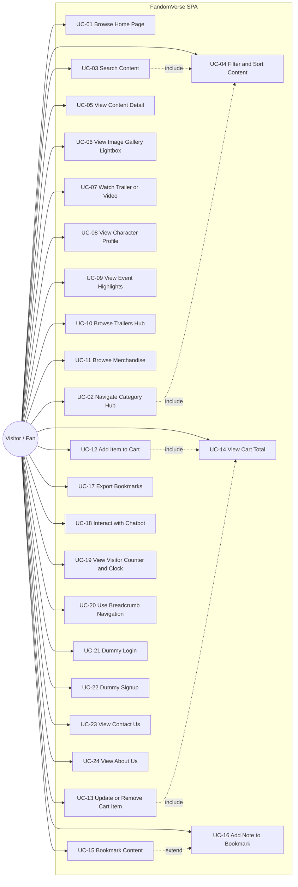

# FandomVerse — Use Case Specification
**Tài liệu tham chiếu:** [fandomverse-srs-v2.md](../fandomverse-srs-v2.md)
**Version:** 1.0

---

## 1. Actors

| Actor | Mô tả |
|---|---|
| **Visitor (Fan)** | Người dùng ẩn danh truy cập website qua trình duyệt. Đây là actor duy nhất tương tác trực tiếp — hệ thống không có backend/tài khoản thật nên không có actor "Admin". |
| **Chatbot Engine** | Actor hệ thống (system actor), phản hồi tự động dựa trên `chatbot_faq.json` khi Visitor gửi câu hỏi. |
| **Web Storage** | Actor hệ thống thụ động, lưu/trả dữ liệu giỏ hàng, bookmark, note, visitor count (LocalStorage/SessionStorage). |

---

## 2. Use Case Diagram

---

## 3. Use Case Specifications

### UC-01 — Browse Home Page
- **Actor:** Visitor
- **Mô tả:** Visitor truy cập trang chủ, xem giới thiệu, nội dung nổi bật và điều hướng tới 7 category hub.
- **Precondition:** Visitor mở URL gốc của website.
- **Main Flow:**
  1. Hệ thống tải `contents.json`, `trailers.json`, `events.json` qua `dataService`.
  2. Hệ thống hiển thị hero banner, carousel nội dung nổi bật (featured articles/trailers/events).
  3. Hệ thống hiển thị grid 7 category (Anime, Gaming, Movies, TV Shows, K-Pop, Comics, Manga).
  4. Hệ thống hiển thị chatbot launcher (nổi góc màn hình).
- **Alternate Flow:**
  - A1: Dữ liệu JSON rỗng/lỗi tải → hiển thị empty-state ("Không có nội dung nổi bật"), không crash trang.
- **Postcondition:** Visitor thấy trang chủ đầy đủ, có thể điều hướng tiếp.
- **Related data:** `contents.json`, `trailers.json`, `events.json`.

---

### UC-02 — Navigate to Category Hub
- **Actor:** Visitor
- **Mô tả:** Visitor chọn 1 trong 7 category để xem catalog nội dung của category đó.
- **Precondition:** Visitor đang ở bất kỳ trang nào có NavBar/category grid.
- **Main Flow:**
  1. Visitor click vào 1 category (vd: Anime).
  2. Router điều hướng tới `#/category/anime`.
  3. `CategoryHub` gọi `dataService.getContentsByCategory('anime')`, `getCharactersByCategory`, `getEventsByCategory`.
  4. Hệ thống render catalog cards, section Characters (≥5), section Events (≥3).
- **Alternate Flow:**
  - A1: Category không tồn tại trong dữ liệu → hiển thị trang "Category not found" với link về Home.
- **Postcondition:** Catalog của category được hiển thị đầy đủ, sẵn sàng cho UC-04, UC-06, UC-08, UC-09.
- **Related data:** `contents.json`, `characters.json`, `events.json` (lọc theo field `category`).

---

### UC-03 — Search Content
- **Actor:** Visitor
- **Mô tả:** Visitor tìm kiếm nội dung toàn site qua search bar (trên NavBar, mọi trang).
- **Precondition:** Visitor gõ từ khóa vào search bar.
- **Main Flow:**
  1. Visitor nhập từ khóa, nhấn Enter/click Search.
  2. Router điều hướng tới `#/search?q=<keyword>`.
  3. `searchService.search(keyword, filters)` quét toàn bộ dataset (contents, characters, events, merchandise, trailers) theo title/description/tags.
  4. Hệ thống hiển thị danh sách kết quả (include UC-04 để filter tiếp theo category/type).
- **Alternate Flow:**
  - A1: Không có kết quả → hiển thị empty-state gợi ý từ khóa khác.
  - A2: Từ khóa rỗng → hiển thị thông báo yêu cầu nhập từ khóa, không gọi search.
- **Postcondition:** Kết quả tìm kiếm hiển thị, có thể lọc thêm.
- **Related data:** toàn bộ file JSON trong `src/data/`.

---

### UC-04 — Filter & Sort Content in Category Hub / Search Results
- **Actor:** Visitor
- **Mô tả:** Visitor thu hẹp kết quả bằng filter (type, sub-tag) và sắp xếp (A-Z, newest, featured).
- **Precondition:** Đang ở CategoryHub hoặc SearchResults với danh sách item hiển thị.
- **Main Flow:**
  1. Visitor chọn filter type (article/gallery/video/audio/merchandise/event) và/hoặc sub-tag.
  2. Visitor chọn tiêu chí sort.
  3. `dataService`/`searchService` áp dụng filter + sort trên mảng dữ liệu hiện có (client-side, không gọi lại network).
  4. UI re-render danh sách đã lọc/sắp xếp.
- **Postcondition:** Danh sách hiển thị khớp filter/sort đã chọn; trạng thái filter phản ánh đúng trên UI (badge/active state).
- **Related data:** field `type`, `subTags`, `dateAdded`, `featured` trong các JSON content.

---

### UC-05 — View Content Detail (Featured Article)
- **Actor:** Visitor
- **Mô tả:** Visitor mở bài viết dài (long-form article) từ card, xem chi tiết + gợi ý liên quan.
- **Main Flow:**
  1. Visitor click vào ContentCard loại `article`.
  2. Router tới `#/category/:cat/article/:id`.
  3. Hệ thống tải chi tiết item theo `id` từ `contents.json`, hiển thị full nội dung.
  4. Hệ thống hiển thị related content (cùng category/sub-tag, loại trừ item hiện tại).
- **Alternate Flow:** A1 — `id` không tồn tại → hiển thị "Not found", link quay lại category.
- **Postcondition:** Nội dung chi tiết hiển thị đầy đủ.
- **Related data:** `contents.json`.

---

### UC-06 — View Image Gallery (Lightbox)
- **Actor:** Visitor
- **Mô tả:** Visitor xem ảnh phóng to dạng lightbox/carousel ngay trong category hub, không rời trang.
- **Main Flow:**
  1. Visitor click vào ảnh/gallery card.
  2. `LightboxGallery` mở modal, hiển thị ảnh đầu tiên.
  3. Visitor điều hướng ảnh kế tiếp/trước bằng nút hoặc phím mũi tên (accessibility).
  4. Visitor đóng modal (nút X, click nền, hoặc phím Esc).
- **Postcondition:** Modal đóng, trang gốc giữ nguyên vị trí cuộn.
- **Related data:** field `images[]` trong `contents.json`.

---

### UC-07 — Watch Trailer / Video
- **Actor:** Visitor
- **Mô tả:** Visitor xem trailer/video/audio nhúng (YouTube hoặc media path tĩnh).
- **Main Flow:**
  1. Visitor click card loại `video`/`audio` hoặc vào mục Trailers.
  2. Hệ thống nhúng player (iframe YouTube hoặc `<video>/<audio>` tag) theo `mediaUrl` trong JSON.
- **Alternate Flow:** A1 — `mediaUrl` không hợp lệ → hiển thị placeholder "Media unavailable".
- **Related data:** `contents.json`, `trailers.json`.

---

### UC-08 — View Character Profile
- **Actor:** Visitor
- **Mô tả:** Visitor xem thông tin nhân vật (Name, Image, Franchise, Biography, Traits) trong category hub, có thể lọc theo franchise.
- **Main Flow:**
  1. Visitor cuộn tới section Characters trong CategoryHub, hoặc lọc theo franchise.
  2. Visitor click CharacterCard để xem chi tiết (modal hoặc trang riêng).
- **Postcondition:** Thông tin nhân vật hiển thị đầy đủ theo schema.
- **Related data:** `characters.json` (≥5 record/category).

---

### UC-09 — View Event Highlights
- **Actor:** Visitor
- **Mô tả:** Visitor xem sự kiện quá khứ/sắp tới (Title, Date, Location, Description) theo category.
- **Main Flow:**
  1. Visitor cuộn tới section Events trong CategoryHub.
  2. Hệ thống phân nhóm Upcoming vs Past dựa trên so sánh `date` với ngày hiện tại.
- **Related data:** `events.json` (≥3 record/category).

---

### UC-10 — Browse Trailers Hub
- **Actor:** Visitor
- **Mô tả:** Visitor xem trang tổng hợp mọi trailer từ tất cả category, lọc theo trạng thái (upcoming/recently released) và category.
- **Main Flow:**
  1. Visitor vào menu "Trailers".
  2. Hệ thống tải `trailers.json`, hiển thị toàn bộ, mặc định sort theo `releaseDate` giảm dần.
  3. Visitor áp dụng filter category + status.
- **Related data:** `trailers.json`.

---

### UC-11 — Browse Merchandise
- **Actor:** Visitor
- **Mô tả:** Visitor xem sản phẩm merchandise (collectibles, apparel, accessories, plushies, figures) theo card, có Image/Name/Price/Description.
- **Main Flow:**
  1. Visitor vào menu "Merchandise" hoặc tab Merchandise trong CategoryHub.
  2. Hệ thống tải `merchandise.json`, hiển thị theo card grid, hỗ trợ filter theo category/loại sản phẩm.
- **Related data:** `merchandise.json`.

---

### UC-12 — Add Item to Cart
- **Actor:** Visitor
- **Mô tả:** Visitor thêm sản phẩm vào giỏ hàng tạm thời.
- **Precondition:** Đang xem trang Merchandise.
- **Main Flow:**
  1. Visitor click "Add to Cart" trên MerchCard.
  2. `CartContext.addItem(product)` cập nhật state + gọi `storageService.saveCart()` ghi vào LocalStorage.
  3. Badge số lượng trên CartIcon (NavBar) cập nhật.
  4. Hệ thống hiển thị toast xác nhận.
  5. *(include)* UC-14 View Cart Total được cập nhật lại.
- **Alternate Flow:** A1 — Sản phẩm đã có trong giỏ → tăng `quantity` thay vì thêm dòng mới.
- **Postcondition:** Giỏ hàng persist qua LocalStorage, còn nguyên sau khi reload trang.
- **Related data:** `merchandise.json`, LocalStorage key `fandomverse_cart`.

---

### UC-13 — Update / Remove Cart Item
- **Actor:** Visitor
- **Mô tả:** Visitor tăng/giảm số lượng hoặc xóa sản phẩm khỏi giỏ.
- **Main Flow:**
  1. Visitor mở CartDrawer/trang Cart.
  2. Visitor bấm +/- để đổi `quantity`, hoặc bấm "Remove".
  3. `CartContext` cập nhật state + persist LocalStorage.
  4. *(include)* UC-14 tính lại tổng tiền.
- **Alternate Flow:** A1 — Giảm quantity về 0 → tự động remove item khỏi giỏ.
- **Related data:** LocalStorage key `fandomverse_cart`.

---

### UC-14 — View Cart Total
- **Actor:** Visitor
- **Mô tả:** Hệ thống tự tính tổng tiền giỏ hàng bằng JavaScript (không backend, không thanh toán thật).
- **Main Flow:**
  1. Mỗi khi cart thay đổi, `CartContext` tính `total = Σ(price × quantity)`.
  2. UI hiển thị tổng tiền, số lượng item.
- **Postcondition:** Không có nút "Checkout"/"Pay" thật sự xử lý thanh toán — chỉ hiển thị tổng kết (đúng Constraint SRS 1.2).
- **Related data:** state trong `CartContext`.

---

### UC-15 — Bookmark Content
- **Actor:** Visitor
- **Mô tả:** Visitor lưu 1 item (article/character/event/merch/trailer) vào danh sách yêu thích.
- **Main Flow:**
  1. Visitor click icon "Bookmark" trên card hoặc trang chi tiết.
  2. `BookmarkContext.toggleBookmark(item)` cập nhật state, gọi `storageService.saveBookmarks()` ghi LocalStorage.
  3. Icon đổi trạng thái (filled/outline) phản ánh đã lưu hay chưa.
- **Postcondition:** Bookmark persist sau khi reload (LocalStorage).
- **Related data:** LocalStorage key `fandomverse_bookmarks`.

---

### UC-16 — Add Note to Bookmark
- **Actor:** Visitor
- **Mô tả:** Visitor viết ghi chú cá nhân gắn với 1 bookmark, chỉ tồn tại trong phiên làm việc hiện tại.
- **Precondition:** Item đã được bookmark (UC-15).
- **Main Flow:**
  1. Visitor mở trang Bookmarks, chọn 1 item.
  2. Visitor nhập note vào textarea.
  3. `storageService.saveNote(itemId, text)` ghi vào SessionStorage.
- **Postcondition:** Note hiển thị lại trong cùng phiên (tab) trình duyệt; **mất khi đóng tab/trình duyệt** (đúng SRS 1.6.12 — session-only).
- **Related data:** SessionStorage key `fandomverse_notes`.

---

### UC-17 — Export Bookmarks
- **Actor:** Visitor
- **Mô tả:** Visitor xuất danh sách bookmark (kèm note nếu có) ra file text định dạng.
- **Main Flow:**
  1. Visitor vào trang Bookmarks, bấm "Export".
  2. Hệ thống build nội dung text từ danh sách bookmark + note hiện có.
  3. Hệ thống tạo Blob và trigger download file `fandomverse-bookmarks.txt`.
- **Alternate Flow:** A1 — Danh sách bookmark rỗng → nút Export bị disable, có tooltip giải thích.
- **Related data:** LocalStorage `fandomverse_bookmarks` + SessionStorage `fandomverse_notes`.

---

### UC-18 — Interact with Chatbot
- **Actor:** Visitor, **Chatbot Engine**
- **Mô tả:** Visitor đặt câu hỏi/chọn quick-reply, chatbot trả lời dựa trên `chatbot_faq.json` (rule-based, không gọi AI API ngoài — Constraint 1.5.3).
- **Main Flow:**
  1. Visitor click chatbot launcher, mở `ChatbotWidget`.
  2. Hệ thống hiển thị quick-reply buttons mặc định (từ `chatbot_faq.json`).
  3. Visitor gõ câu hỏi hoặc click quick-reply.
  4. Chatbot Engine match keyword trong input với `keywords[]` của từng FAQ entry (case-insensitive, không phân biệt dấu).
  5. Chatbot trả lời `answer`, kèm nút deep-link (nếu FAQ có `link` tới route nội bộ).
- **Alternate Flow:**
  - A1: Không match keyword nào → trả lời fallback mặc định + gợi ý quick-reply.
- **Postcondition:** Lịch sử hội thoại giữ trong state của widget (không persist bắt buộc).
- **Related data:** `chatbot_faq.json`.

---

### UC-19 — View Visitor Counter & Real-Time Clock
- **Actor:** Visitor
- **Mô tả:** Hệ thống hiển thị đồng hồ thời gian thực và bộ đếm lượt truy cập giả lập.
- **Main Flow:**
  1. Khi tải trang, `RealTimeClock` set `setInterval` 1s cập nhật giờ hiển thị (footer).
  2. Khi tải trang lần đầu trong phiên, `storageService.incrementVisitorCount()` tăng giá trị lưu trong LocalStorage và hiển thị.
- **Related data:** LocalStorage key `fandomverse_visitor_count`.

---

### UC-20 — Use Breadcrumb Navigation
- **Actor:** Visitor
- **Mô tả:** Hệ thống hiển thị đường dẫn điều hướng (Home / Category / Item) dựa trên route hiện tại, cho phép click quay lại cấp cha.
- **Main Flow:**
  1. Route thay đổi → `Breadcrumb` tính lại mảng segment từ `useLocation()`.
  2. Hiển thị các segment dạng link, segment cuối không phải link (trang hiện tại).

---

### UC-21 — Dummy Login
- **Actor:** Visitor
- **Mô tả:** Visitor xem/thao tác form đăng nhập UI thuần, không xác thực thật (không backend).
- **Main Flow:**
  1. Visitor vào `#/login`, nhập email/password bất kỳ.
  2. Visitor bấm "Login".
  3. Hệ thống hiển thị thông báo giả lập ("Demo mode — không xử lý xác thực thật") — **không lưu, không gửi dữ liệu đi đâu**.
- **Postcondition:** Không có phiên đăng nhập thật được tạo.

---

### UC-22 — Dummy Signup
- Tương tự UC-21, áp dụng cho form đăng ký (`#/signup`).

---

### UC-23 — View Contact Us
- **Actor:** Visitor
- **Mô tả:** Visitor xem trang liên hệ tĩnh có nhúng Google Maps (iframe) và thông tin GPS/địa chỉ giả định.

---

### UC-24 — View About Us
- **Actor:** Visitor
- **Mô tả:** Visitor xem trang giới thiệu tĩnh về dự án FandomVerse.

---

## 4. Traceability Matrix (Use Case ↔ SRS Functional Requirement)

| Use Case | SRS Ref |
|---|---|
| UC-01 | 1.6.1 |
| UC-02 | 1.6.2 |
| UC-03, UC-04 | 1.6.2, 1.6.3 |
| UC-05 | 1.6.6 |
| UC-06 | 1.6.4 |
| UC-07 | 1.6.5 |
| UC-08 | 1.6.7 |
| UC-09 | 1.6.8 |
| UC-10 | 1.6.9 |
| UC-11, UC-12, UC-13, UC-14 | 1.6.10 |
| UC-15, UC-16, UC-17 | 1.6.12 |
| UC-18 | 1.6.11 |
| UC-19, UC-20, UC-21, UC-22, UC-23, UC-24 | 1.6.13 |
