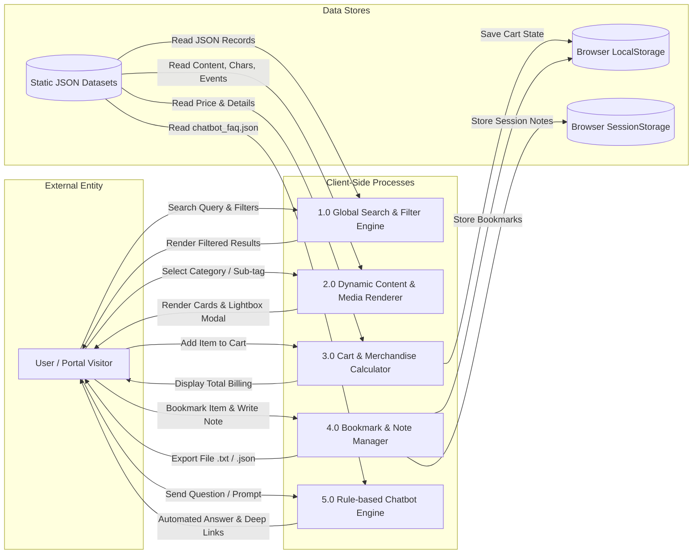
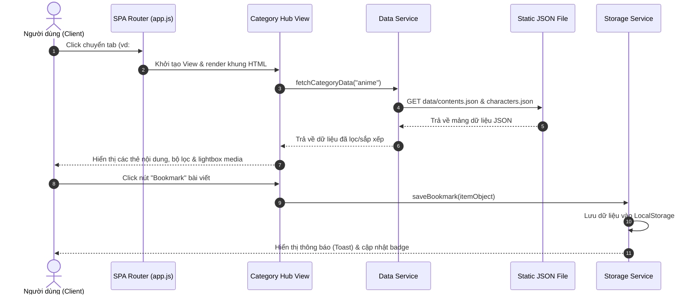

# FandomVerse - Software Requirements Specification (SRS)
**Version:** 2.0  
**Project Name:** FandomVerse  
**Theme:** Fandom Universe  
**Category:** Web Innovation Unleashed  
**Publisher:** © Aptech Limited  

---

## Table of Contents
1. [1.1 Background and Necessity for the Website](#11-background-and-necessity-for-the-website)
2. [1.2 Proposed Solution](#12-proposed-solution)
3. [1.3 Purpose of the Document](#13-purpose-of-the-document)
4. [1.4 Scope of Project](#14-scope-of-project)
5. [1.5 Constraints](#15-constraints)
6. [1.6 Functional Requirements](#16-functional-requirements)
7. [1.7 Non-Functional Requirements](#17-non-functional-requirements)
8. [1.8 Interface Requirements](#18-interface-requirements)
9. [1.9 Project Deliverables](#19-project-deliverables)
10. [1.10 System Architecture & Diagrams](#110-system-architecture--diagrams)

---

## 1.1 Background and Necessity for the Website
Fandom is a group or community of fans sharing a common passion. Fandoms centered around **anime, gaming, movies, TV shows, Korean-Pop (K-Pop), comics, and manga** have become some of the most active and passionate online communities.

Fans are constantly looking for the latest news, character information, trailers, merchandise, events, and community discussions related to their favorite interests. However, today, this information is scattered across multiple portals such as fan wikis, streaming services, social media, ticketing websites, online stores, and news portals. As a result, fans often must switch between several websites just to stay updated on a single fandom, making the experience time-consuming and inconvenient.

Discovering new fandoms or exploring related interests can also be challenging because there is no single portal that brings everything together. To address this issue, there is a requirement for a centralized and visually engaging website that combines content from multiple fandom categories in one place. Such a portal would allow users to easily browse articles, explore characters, view trailers and media, discover upcoming events, and access merchandise through a well-organized and user-friendly interface.

By bringing together diverse fandom content into a single hub, the website would enhance content discovery, improve accessibility, and provide a more enjoyable experience for fans of all interests.

---

## 1.2 Proposed Solution
The proposed solution is to develop a website called **‘FandomVerse’** that serves as an engaging and visually rich information hub for fandom enthusiasts.

The website enables visitors to browse and explore curated content across **seven primary categories**:
* **Anime**
* **Gaming**
* **Movies**
* **TV Shows**
* **K-Pop**
* **Comics**
* **Manga**

Key aspects of the solution:
* **Search, Sorting, and Filtering**: Allows users to discover more about their favorite fandoms easily.
* **Rich Content Showcase**: Image galleries, videos, audio clips, featured articles, character profiles, event highlights, trailers, merchandise collections, and information on upcoming releases.
* **Merchandise Showcase & Shopping Cart**: Users can browse officially licensed collectibles, apparel, accessories, plushies, and figures, and add them to a temporary shopping cart (actual checkout/payment is excluded).
* **No-Backend Architecture**: Developed using HTML5, CSS3, JavaScript, Bootstrap/ReactJS/AngularJS, jQuery, and pre-populated JSON/Text files.
* **Single Page Application (SPA)**: Fast, visually appealing, lightweight, and responsive across desktop, tablet, and mobile devices.
* **AI-Powered Chatbot**: Virtual assistant operating on a rule-based pre-scripted JSON dataset to answer FAQs and assist navigation without external backend dependencies.

---

## 1.3 Purpose of the Document
This Software Requirements Specification (SRS) document outlines the functional, non-functional, and technical requirements for the development of the **‘FandomVerse’** website. It defines goals, scope, features, constraints, and user expectations.

### 1.3.1 Target Audience / Stakeholders
* Project Stakeholders
* Developers and UI/UX Designers

---

## 1.4 Scope of Project
FandomVerse is a browser-based Single Page Application (SPA) designed to unify multiple fan communities under one platform.

**Core Scope:**
* **Category Hubs**: Dedicated sections for Anime, Gaming, Movies, TV Shows, K-Pop, Comics, and Manga.
* **Global Search**: Search bar with category and content-type filtering over client-side JSON data.
* **Multimedia & Content**: Image galleries with Lightbox/Carousel, embedded video/audio clips, featured long-form articles, character profiles, and event schedules.
* **Trailers Section**: Centralized section for trailers filterable by category and release status.
* **Merchandise Showcase**: Card-based product display with temporary shopping cart and total billing calculation via JavaScript.
* **Interactive AI Chatbot**: Floating virtual assistant answering FAQs and recommending content based on predefined JSON rules.
* **Responsive Design**: Compatible across desktop, tablet, and mobile browsers.

---

## 1.5 Constraints
1. **No Server-Side Database / Backend**: The website cannot store information on a server or write data back to JSON/TXT files dynamically. All content is fetched from static pre-populated JSON/TXT files.
2. **Copyright & Licensing**: Only original, royalty-free, or licensed non-copyrighted content may be used.
3. **Chatbot Service Limit**: The chatbot must operate entirely on a local, pre-scripted dataset (JSON-based) without calling live external AI APIs or backends.

---

## 1.6 Functional Requirements

### 1.6.1 Home Page
* **UI Elements**: Portal logo, animated title heading, introductory text.
* **Category Navigation**: Responsive navbar or grid linking to all 7 category hubs.
* **Featured Content**: Showcase/carousel of featured articles, trailers, and upcoming events.
* **Chatbot Launcher**: Floating chatbot icon accessible on all pages.

### 1.6.2 Category Hubs
* **Content Catalog**: Dynamically renders cards from category-specific JSON files.
* **Card Details**: Title, thumbnail image, short description, content type (article, gallery, video, audio), and sub-tags.
* **Filtering**: Filter by type (articles, galleries, videos, audio, character profiles, events, merchandise, releases) and category sub-tags.
* **Sorting**: Alphabetical, newest, or popularity/featured status.

### 1.6.3 Global Search
* **Search Bar**: Accessible from every page.
* **Filtering**: Search results can be filtered by category and content type.
* **Logic**: Client-side JavaScript execution over the pre-populated JSON dataset.

### 1.6.4 Image Galleries
* Integrated lightbox or carousel view within every category hub for browsing images without leaving the page.

### 1.6.5 Videos & Audio Clips
* Embedded trailers, interviews, fan creations, and podcast-style audio clips (loaded from YouTube links or static media paths in JSON).

### 1.6.6 Featured Articles
* Long-form articles and news with detail views and related content suggestions.

### 1.6.7 Character Profiles
* At least **5 character profiles per category** containing Name, Image, Franchise/Series, Biography, and Traits. Filterable by category and franchise.

### 1.6.8 Event Highlights
* At least **3 events per category** (past and upcoming). Fields: Title, Date, Location, Description, and Category.

### 1.6.9 Trailers Section
* Centralized trailer hub aggregating video links across all categories with status filters (*upcoming*, *recently released*).

### 1.6.10 Merchandise Showcase & Shopping Cart
* Product cards containing Image, Name, Price/Price Range, and Short Description.
* Temporary shopping cart calculating total amount automatically using JavaScript (No checkout or actual payment processing).

### 1.6.11 AI-Powered Chatbot
* Floating widget available site-wide using a pre-scripted FAQ dataset (`chatbot_faq.json`). Supports quick reply buttons and deep-linking to internal category pages.

### 1.6.12 Content Bookmarking & Notes
* Favorite content saved to browser **LocalStorage**.
* Personal notes attached to bookmarks stored in **SessionStorage** (session-only).
* Option to export bookmarked items as a formatted text list.

### 1.6.13 Supplemental UI Features
* **Visitor Counter**: Simulated using JavaScript and LocalStorage.
* **Real-Time Clock**: Live date and time display via JS.
* **Breadcrumb Navigation**: Dynamic trail for enhanced user navigation.
* **Dummy Login / Signup**: Visual UI buttons for login/signup without backend authentication.
* **Static Pages**: Contact Us (with Google Maps & GPS info) and About Us page.

### 1.6.14 AI Usage Policy Guidelines
* AI tools (Canva AI, Figma AI, ChatGPT, Copilot, etc.) are allowed for design assistance, code debugging, FAQ drafting, and graphics generation.
* Submissions must demonstrate original understanding and implementation; raw, unmodifed template boilerplates are prohibited.

---

## 1.7 Non-Functional Requirements
* **Safety**: No malicious downloads or unrequested file executions.
* **Accessibility**: High contrast, keyboard shortcuts, legible fonts, screen-reader friendly.
* **User-Friendliness**: Clear layout, intuitive navigation, fast interaction.
* **Operability & Performance**: Smooth transitions, fast load times, high throughput.
* **Capacity**: Supports multiple simultaneous client-side users.
* **Availability**: 24/7 client-side availability.
* **Compatibility**: Full compatibility with modern web browsers and responsive viewports.

---

## 1.8 Interface Requirements

### 1.8.1 Hardware Specifications
* Processor: Intel Core i5/i7 or higher
* RAM: 8 GB or higher
* Display: Color SVGA
* Storage: 500 GB Hard Disk space
* Input: Mouse & Keyboard

### 1.8.2 Software & Technology Stack
* **IDEs**: VS Code, Notepad++, CoffeeCup HTML5 Editor.
* **Frontend**: HTML5, CSS3, JavaScript, jQuery, Bootstrap / ReactJS / AngularJS.
* **Design & AI Tools**: Figma, Canva, Framer, Uizard, ChatGPT, Claude, Gemini, GitHub Copilot.
* **Chatbot Integrations**: Pre-scripted JSON engine or Tawk.to / Tidio widgets.
* **Data Store**: Pre-populated JSON or TXT static files.

---

## 1.9 Project Deliverables
1. **Project Report (`project_report.pdf`)**: Complete technical documentation containing Problem Definition, Design Specifications, DFD/Flowcharts, Test Data, and Installation Instructions (no source code inside report).
2. **Source Code**: Consolidated `.zip` file containing all HTML, CSS, JS, and JSON assets, alongside a `ReadMe.doc` listing assumptions.
3. **Video Demo (`.mp4`)**: **MANDATORY** video demonstrating all operational features of the portal.
4. **Live Hosted URL (Optional)**: Public web URL if hosted.
5. **Quality Assessment**: Tested using Google Lighthouse for performance, accessibility, and SEO.

---

## 1.10 System Architecture & Diagrams

### 1.10.1 Single Page Application (SPA) Architecture Diagram
Sơ đồ thể hiện luồng điều hướng SPA, các module giao diện và việc tương tác dữ liệu với các tệp JSON tĩnh cũng như bộ nhớ trình duyệt (Web Storage):

```mermaid
graph TD
    User([User / Browser Client]) -->|Loads URL / Hash Change| Router[SPA Router app.js]
    
    subgraph Client-Side Architecture (No Backend)
        Router -->|#home| HomeView[Home Page View]
        Router -->|#category| CatView[Category Hub View]
        Router -->|#search| SearchView[Search Results View]
        Router -->|#merchandise| MerchView[Merchandise & Cart View]
        Router -->|#bookmarks| BookmarkView[Bookmarks & Notes View]
        
        HomeView -->|Fetch Data| DataSvc[dataService.js]
        CatView -->|Fetch Data| DataSvc
        SearchView -->|Query Filter| SearchSvc[searchService.js]
        MerchView -->|Manage Cart| StorageSvc[storageService.js]
        BookmarkView -->|Manage Bookmarks| StorageSvc
        
        ChatbotWidget[Floating AI Chatbot] -->|Match Keywords| BotData[(chatbot_faq.json)]
    end
    
    subgraph Static Data Store (JSON Datasets)
        DataSvc -->|Load| ContentsJSON[(contents.json)]
        DataSvc -->|Load| CharsJSON[(characters.json)]
        DataSvc -->|Load| EventsJSON[(events.json)]
        DataSvc -->|Load| TrailersJSON[(trailers.json)]
        DataSvc -->|Load| MerchJSON[(merchandise.json)]
        SearchSvc -->|Scan All| StaticData[All JSON Datasets]
    end
    
    subgraph Browser Web Storage
        StorageSvc -->|Read/Write Cart & Favorites| LocalStorage[(Browser LocalStorage)]
        StorageSvc -->|Read/Write Personal Notes| SessionStorage[(Browser SessionStorage)]
    end
```

---

### 1.10.2 Data Flow Diagram (DFD Level 0 & Level 1)
Sơ đồ luồng dữ liệu mô tả sự di chuyển của thông tin giữa người dùng, các xử lý logic client-side và các kho dữ liệu tĩnh/bộ nhớ trình duyệt:



---

### 1.10.3 Sequence Diagram: Category Loading & Bookmarking Workflow
Sơ đồ trình tự mô tả các bước tương tác khi người dùng truy cập một danh mục và thực hiện lưu nội dung yêu thích:


