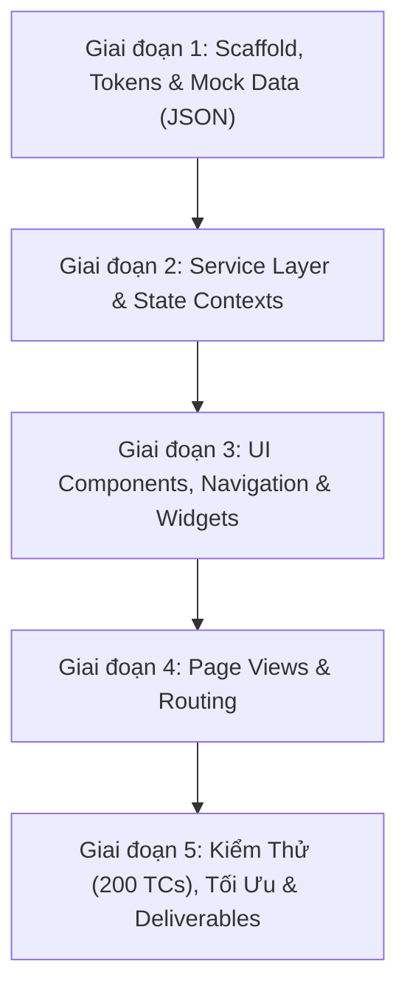

# Kế Hoạch Triển Khai Chi Tiết Dự Án FandomVerse (plan.md)
**Dự án:** FandomVerse — Nền tảng tổng hợp vũ trụ Fandom  
**Cuộc thi:** TechWir — Web Innovation Unleashed (Publisher: © Aptech Limited)  
**Phiên bản kế hoạch:** 2.1 (Cập nhật sau đợt rà soát tài liệu toàn diện ngày 23/09/2026 — đồng bộ route Content Detail, Login/Signup dạng trang riêng, bỏ canvas-confetti)  
**Tài liệu tham chiếu chính:**  
- [fandomverse-srs-v2.md](./fandomverse-srs-v2.md) (SRS gốc v2.0)  
- [docs/srs-compliance-matrix.md](./docs/srs-compliance-matrix.md) (Ma trận tuân thủ v1.1)  
- [docs/data-structure-and-flow.md](./docs/data-structure-and-flow.md) (Cấu trúc dữ liệu & Luồng thông tin v1.0)  
- [docs/clean-code-guidelines.md](./docs/clean-code-guidelines.md) (Quy chuẩn mã sạch & React v1.0)  
- [docs/usecase-specification.md](./docs/usecase-specification.md) (Đặc tả 24 Use Cases v1.0)  
- [FandomVerse_TestCase_UI_HuongDan_DaSua.xlsx](./FandomVerse_TestCase_UI_HuongDan_DaSua.xlsx) (Bộ 200 UI Test Cases chính thức)  
- [design/01-design-system.md](./design/01-design-system.md), [design/02-components.md](./design/02-components.md), [design/03-page-layouts.md](./design/03-page-layouts.md) (Đặc tả thiết kế UI/UX)  

---

## 1. Báo Cáo Rà Soát Toàn Diện Tài Liệu & Các Điểm Cập Nhật Mới Nhất

Qua quá trình rà soát chéo (cross-audit) từ đầu toàn bộ các tệp trong kho lưu trữ, các phát hiện và cập nhật quan trọng được ghi nhận như sau:

### 1.1 Các điểm cập nhật mới trong tài liệu
1. **Hợp nhất tài liệu kiểm thử về file Excel chính thức:**  
   - File markdown sơ bộ `docs/test-cases.md` đã được lược bỏ để tránh phân mảnh dữ liệu.  
   - [FandomVerse_TestCase_UI_HuongDan_DaSua.xlsx](./FandomVerse_TestCase_UI_HuongDan_DaSua.xlsx) là tài liệu **duy nhất và chính thức** dùng để thực thi, ghi nhận và thống kê kết quả kiểm thử. Bộ test case gồm **200 UI test cases** chia làm 14 nhóm chức năng bám sát SRS (17 Critical, 65 Major, 118 Minor), có bảng tổng hợp tự động tính toán.  
   - [docs/srs-compliance-matrix.md](./docs/srs-compliance-matrix.md) đã nâng cấp lên **Version 1.1**, cập nhật lại toàn bộ cột tham chiếu sang định dạng mã kiểm thử trong Excel: `xlsx TC_<MODULE>_<NUM>`.
2. **Chuẩn hóa kiến trúc 4 Services tại tầng Service Layer:**  
   - Trong [docs/data-structure-and-flow.md](./docs/data-structure-and-flow.md) §4 và ma trận SRS, dịch vụ **`chatbotService.js`** đã được chính thức bổ sung thành service thứ 4 (cùng với `dataService.js`, `searchService.js`, `storageService.js`).  
   - *Lý do kỹ thuật:* Đảm bảo tuân thủ triệt để Quy tắc Clean Code §4.1 ("Không import trực tiếp file JSON vào UI Component"). Logic so khớp từ khóa và phản hồi FAQ của Chatbot được đóng gói độc lập trong `chatbotService.js`, Component `ChatbotWidget.jsx` chỉ gọi hàm nghiệp vụ.
3. **Bổ sung chuẩn hóa trường dữ liệu giá trong `merchandise.json`:**  
   - Khớp với yêu cầu SRS 1.6.10 ("Price / Price Range"), schema `merchandise.json` quy định rõ: trường `price` (number) là giá cố định hoặc giá tối thiểu; trường `priceMax` (number | null) là giá tối đa khi sản phẩm có khoảng giá, hoặc `null` nếu là giá cố định.
4. **Đồng bộ route Content Detail với Use Case Spec:**  
   - Sửa route từ `#/content/:contentId` (phẳng, không có category) thành `#/category/:categoryId/article/:contentId`, đúng UC-05 và giữ đủ ngữ cảnh category để `Breadcrumb.jsx` hiển thị đúng "Home / Category / Bài viết".
5. **Chuẩn hóa Login/Signup thành trang riêng, bỏ phương án Modal:**  
   - Loại bỏ `AuthModals.jsx`, thay bằng `Login.jsx`/`Signup.jsx` trong `pages/` tại route `#/login`, `#/signup` — khớp với [design/03-page-layouts.md mục 8](./design/03-page-layouts.md) và [usecase-specification.md UC-21/UC-22](./docs/usecase-specification.md) đã duyệt trước đó.
6. **Bỏ `canvas-confetti` khỏi Tech Stack:**  
   - Hiệu ứng confetti không phù hợp nguyên tắc "không flashy" trong [01-design-system.md §7](./design/01-design-system.md); giữ micro-interaction bằng CSS Transitions thuần (scale nhẹ + toast) như đã đặc tả ở [03-page-layouts.md mục 5](./design/03-page-layouts.md).

### 1.2 Đánh giá mức độ sẵn sàng của dự án
- **Tính đầy đủ (Completeness):** Đạt 100% đối chiếu yêu cầu SRS (Chức năng 1.6, Phi chức năng 1.7, Ràng buộc 1.5, Kiến trúc 1.10).
- **Tính nhất quán (Consistency):** Tuyệt đối. Từ khóa category (`anime`, `gaming`, `movies`, `tvshows`, `kpop`, `comics`, `manga`), mã lưu trữ (`fandomverse_*`), tên file và hàm service đều đồng bộ 1:1 giữa docs, design và test case.
- **Hiện trạng mã nguồn:** Kho lưu trữ hiện mới có tài liệu thiết kế và đặc tả, chưa khởi tạo mã nguồn React và các file JSON dữ liệu tĩnh.

---

## 2. Kiến Trúc Kỹ Thuật & Công Nghệ (Tech Stack)

Bám sát đặc tả SRS §1.8.2 và quyết định kiến trúc tại [docs/srs-compliance-matrix.md](./docs/srs-compliance-matrix.md) §2:

| Thành phần | Công nghệ / Thư viện | Vai trò & Lý do lựa chọn |
|---|---|---|
| **Core Framework** | **React 18** (Vite) | Xây dựng Single Page Application (SPA), component hóa mạnh mẽ, tốc độ biên dịch HMR cực nhanh. |
| **CSS & UI Framework** | **Bootstrap 5.3 + Bootstrap Icons** | Hệ thống lưới responsive 12 cột, modal, offcanvas, kết hợp với các biến CSS token từ Design System. |
| **Routing** | **`react-router-dom` (v6) với `HashRouter`** | Điều hướng dạng Hash (`#/`, `#/category/:id`...) đúng chuẩn SPA Architecture trong SRS §1.10.1, tương thích 100% khi host tĩnh trên GitHub Pages mà không gặp lỗi 404 rewrite. |
| **Data Layer (Read-Only)** | **6 Tệp JSON tĩnh trong `src/data/`** | Mô phỏng cơ sở dữ liệu phi máy chủ (No-Backend Constraint 1.5.1). Không component nào được sửa hay import trực tiếp. |
| **State Management** | **React Context API** (`CartContext`, `BookmarkContext`) | Quản lý trạng thái toàn cục cho Giỏ hàng tạm tính và Danh sách yêu thích. |
| **Storage Layer** | **`storageService.js`** | Đóng gói tương tác an toàn với `localStorage` (Cart, Bookmarks, Visitor Count) và `sessionStorage` (Notes session-only). |
| **Animation & UX** | **CSS Transitions** | Micro-interaction mượt mà (hover, scale nhẹ, toast) đúng nguyên tắc "không flashy" trong [01-design-system.md §7](./design/01-design-system.md). |

---

## 3. Cấu Trúc Thư Mục Dự Án Chuẩn Hóa

```
FandomVerse-Techwir/
├── docs/                                  # Bộ tài liệu kiến trúc & đặc tả
│   ├── clean-code-guidelines.md
│   ├── data-structure-and-flow.md
│   ├── srs-compliance-matrix.md
│   └── usecase-specification.md
├── design/                                # Bộ tài liệu thiết kế UI/UX
│   ├── 01-design-system.md
│   ├── 02-components.md
│   ├── 03-page-layouts.md
│   └── README.md
├── FandomVerse_TestCase_UI_HuongDan_DaSua.xlsx # 200 UI Test Cases chính thức
├── fandomverse-srs-v2.md                  # SRS đề bài v2.0
├── plan.md                                # Kế hoạch triển khai tổng thể này
├── README.md                              # Hướng dẫn dự án & cài đặt
├── package.json                           # Cấu hình dự án Vite React
├── vite.config.js                         # Cấu hình Vite & path alias (@)
├── index.html                             # Single page HTML entry
└── src/
    ├── main.jsx                           # Entry point React
    ├── App.jsx                            # HashRouter + Route definitions + Context Providers
    ├── constants.js                       # CATEGORY_LIST, STORAGE_KEYS, CONTENT_TYPES
    ├── styles/
    │   ├── design-tokens.css              # 7 màu accent, typography, spacing, shadows
    │   └── global.css                     # Reset, custom scrollbar, layout utils
    ├── data/                              # 6 static JSON datasets (Read-only)
    │   ├── contents.json                  # Articles, galleries, videos, audios
    │   ├── characters.json                # ≥5 chars/category (≥35 records)
    │   ├── events.json                    # ≥3 events/category (≥21 records)
    │   ├── trailers.json                  # Video trailers + status upcoming/released
    │   ├── merchandise.json               # ≥3 items/category (≥21 records) + price/priceMax
    │   └── chatbot_faq.json               # FAQ rules, keywords, answers, deep-links + fallback
    ├── services/                          # Tầng nghiệp vụ thuần túy (Pure JS, no JSX)
    │   ├── dataService.js                 # Đọc, lọc, sắp xếp dữ liệu từ JSON
    │   ├── searchService.js               # Tìm kiếm toàn cục đa dataset
    │   ├── storageService.js              # Giao tiếp an toàn với Web Storage
    │   └── chatbotService.js              # Khớp từ khóa FAQ, gợi ý câu trả lời & deep-link
    ├── context/                           # React Context Providers
    │   ├── CartContext.jsx                # Quản lý giỏ hàng, số lượng, tổng bill
    │   └── BookmarkContext.jsx            # Quản lý lưu trữ bookmark, đồng bộ Storage
    ├── hooks/                             # Custom React Hooks
    │   ├── useCategoryData.js             # Hook nạp dữ liệu cho trang Category
    │   ├── useRealTimeClock.js            # Hook cập nhật đồng hồ mỗi giây
    │   └── useVisitorCounter.js           # Hook tăng và đọc số lượt truy cập
    ├── components/                        # UI Components dùng chung
    │   ├── common/
    │   │   ├── Navbar.jsx                 # Header, menu 7 category, search, badges
    │   │   ├── Footer.jsx                 # Real-time clock, visitor counter, static links
    │   │   ├── Breadcrumb.jsx             # Thanh điều hướng phân cấp động
    │   │   ├── ToastNotification.jsx      # Thông báo nổi (Toast)
    │   │   └── EmptyState.jsx             # Giao diện khi không có dữ liệu
    │   ├── cards/
    │   │   ├── ContentCard.jsx            # Card bài viết/gallery/media + accent border
    │   │   ├── CharacterCard.jsx          # Card nhân vật tròn, franchise, traits
    │   │   ├── EventCard.jsx              # Card sự kiện với date block, upcoming/past badge
    │   │   └── MerchCard.jsx              # Card sản phẩm, hiển thị giá/khoảng giá + Add to Cart
    │   └── interactive/
    │       ├── LightboxGallery.jsx        # Xem ảnh phóng to, phím Esc, prev/next
    │       ├── VideoModal.jsx             # Modal phát video YouTube embed
    │       ├── CartDrawer.jsx             # Offcanvas giỏ hàng tạm + tính tiền JS
    │       └── ChatbotWidget.jsx          # Trợ lý ảo nổi góc màn hình + quick replies
    └── pages/                             # Các màn hình chính (Page Views)
        ├── Home.jsx                       # Trang chủ, hero, category tiles, featured carousel
        ├── CategoryHub.jsx                # Trang chuyên mục 7 fandom + 3 tab (Content/Char/Event)
        ├── ContentDetail.jsx              # Chi tiết bài viết long-form + gợi ý liên quan
        ├── TrailersHub.jsx                # Trung tâm trailers, bộ lọc category & status
        ├── Merchandise.jsx                # Danh mục sản phẩm lưu niệm
        ├── Bookmarks.jsx                  # Danh sách đã lưu + ghi chú session + xuất file .txt
        ├── SearchResults.jsx              # Kết quả tìm kiếm toàn cục
        ├── Contact.jsx                    # Trang liên hệ, tọa độ GPS & Google Maps
        ├── About.jsx                      # Giới thiệu dự án FandomVerse
        ├── Login.jsx                       # Trang đăng nhập giả lập (Dummy UI, card giữa màn hình)
        ├── Signup.jsx                      # Trang đăng ký giả lập (Dummy UI, card giữa màn hình)
        └── NotFound.jsx                   # Trang 404 thân thiện
```

---

## 4. Lộ Trình Triển Khai Chi Tiết 5 Giai Đoạn



### Giai đoạn 1: Khởi Tạo Dự Án, Design Tokens & Tạo Dữ Liệu Tĩnh (Data Layer)
- [ ] **Khởi tạo Vite React:** Cài đặt Vite với React 18, cấu hình alias `@` trỏ tới `src/`.
- [ ] **Cài đặt dependencies:** `bootstrap`, `bootstrap-icons`, `react-router-dom`.
- [ ] **Thiết lập Design System CSS:**  
  - Tạo `src/styles/design-tokens.css`: Khai báo biến màu (Primary `#6C5CE7`, Accent `#FF6B81`, 7 màu accent category), typography (Poppins cho tiêu đề, Inter cho nội dung), bo góc, shadows.  
  - Tạo `src/styles/global.css`: Base styles, custom scrollbar, layout wrapper.
- [ ] **Tạo 6 tệp JSON chuẩn hóa trong `src/data/`:**
  - `contents.json`: Tối thiểu 14-20 bài viết/gallery/video/audio rải đều 7 category, gắn cờ `featured: true` cho các mục tiêu biểu trên Home.
  - `characters.json`: Đảm bảo **tối thiểu 5 nhân vật mỗi category** (tổng cộng ≥ 35 nhân vật), đầy đủ trường `franchise`, `biography`, `traits`.
  - `events.json`: Đảm bảo **tối thiểu 3 sự kiện mỗi category** (tổng cộng ≥ 21 sự kiện), có cả ngày tương lai (Upcoming) và quá khứ (Past).
  - `trailers.json`: Danh sách trailer video đa dạng category, trạng thái `upcoming` hoặc `released`.
  - `merchandise.json`: Tối thiểu 3 sản phẩm mỗi category (≥ 21 sản phẩm), hỗ trợ cả giá đơn lẻ (`price`) và khoảng giá (`priceMax`).
  - `chatbot_faq.json`: Bộ câu hỏi FAQ rule-based bám sát các thắc mắc thường gặp, có keywords, câu trả lời, deep-link `#/...` và mục fallback `faq-fallback`.
- [ ] **Cập nhật README.md** gốc với hướng dẫn chạy dự án, cấu trúc thư mục và liên kết tài liệu.
- **Tiêu chí hoàn thành (DoD Giai đoạn 1):** Chạy `npm run dev` hiển thị trang trắng ban đầu không lỗi; 6 file JSON hợp lệ cú pháp, đủ chỉ tiêu số lượng bản ghi tối thiểu.

### Giai đoạn 2: Tầng Nghiệp Vụ (Services) & Quản Lý Trạng Thái (Contexts)
- [ ] **Xây dựng `src/constants.js`:** Danh sách category chuẩn (`CATEGORY_LIST`), storage keys (`STORAGE_KEYS`).
- [ ] **Xây dựng `src/services/storageService.js`:**
  - Bọc các phương thức đọc/ghi `localStorage` (`fandomverse_cart`, `fandomverse_bookmarks`, `fandomverse_visitor_count`).
  - Bọc đọc/ghi `sessionStorage` (`fandomverse_notes`).
  - Xử lý `try/catch` an toàn khi `JSON.parse` hoặc khi môi trường chặn cookie/storage.
- [ ] **Xây dựng `src/services/dataService.js`:**
  - Hàm nạp dữ liệu theo danh mục: `getContentsByCategory`, `getCharactersByCategory`, `getEventsByCategory`, `getTrailersByCategory`, `getMerchandiseByCategory`.
  - Hàm lọc dữ liệu theo content type, sub-tags, franchise.
  - Hàm sắp xếp: Alphabetical (A-Z), Newest (theo `dateAdded`), Featured.
- [ ] **Xây dựng `src/services/searchService.js`:**
  - Quét toàn bộ dataset (contents, characters, events, trailers, merchandise) theo từ khóa không phân biệt hoa thường, kết hợp bộ lọc Category và Content Type.
- [ ] **Xây dựng `src/services/chatbotService.js`:**
  - Đọc `chatbot_faq.json`, so khớp câu hỏi người dùng với mảng `keywords` (lowercase), trả về phản hồi kèm deep-link tương ứng hoặc câu trả lời mặc định.
- [ ] **Xây dựng React Contexts:**
  - `CartContext.jsx`: Action `addItem`, `updateQuantity`, `removeItem`, `clearCart`. Tự động tính toán tổng bill `totalAmount` bằng JavaScript.
  - `BookmarkContext.jsx`: Action `toggleBookmark`, kiểm tra `isBookmarked(id)`.
- **Tiêu chí hoàn thành (DoD Giai đoạn 2):** Các hàm service chạy thuần thục, unit test logic / chạy console test không có lỗi logic, Context Provider cung cấp dữ liệu ổn định.

### Giai đoạn 3: Thành Phần Giao Diện Chung (UI Components & Widgets)
- [ ] **Layout Shell:**
  - `Navbar.jsx`: Logo thương hiệu, menu 7 category dropdown, ô tìm kiếm nhanh, nút mở Cart Drawer (badge đếm), nút Bookmarks (badge đếm), nút Login/Signup giả lập, hamburger menu responsive trên Mobile.
  - `Footer.jsx`: Đồng hồ thời gian thực (`RealTimeClock`), Bộ đếm lượt truy cập (`VisitorCounter`), liên kết nhanh, bản quyền.
  - `Breadcrumb.jsx`: Điều hướng động theo hash đường dẫn hiện tại.
- [ ] **Hệ thống Card (Thư viện Card bám sát Design Spec §2):**
  - `ContentCard.jsx`: Ảnh tỉ lệ 16:9, badge danh mục mang màu sắc accent riêng, nút bookmark nhanh, nút xem chi tiết.
  - `CharacterCard.jsx`: Khung avatar tròn, tên nhân vật, tên franchise, các trait chip.
  - `EventCard.jsx`: Khối lịch ngày tháng bên trái, tiêu đề, địa điểm, badge trạng thái Upcoming / Past.
  - `MerchCard.jsx`: Ảnh sản phẩm vuông 1:1, hiển thị giá hoặc khoảng giá, nút Accent "Add to Cart".
- [ ] **Interactive Modals & Widgets:**
  - `LightboxGallery.jsx`: Modal xem ảnh gallery phóng to, hỗ trợ duyệt ảnh trước/sau, phím Esc và bấm ra ngoài để đóng.
  - `VideoModal.jsx`: Modal trình phát video trailer nhúng iframe YouTube.
  - `CartDrawer.jsx`: Offcanvas hiển thị giỏ hàng tạm, nút tăng/giảm số lượng, xóa món, tổng số tiền thanh toán tính tự động, nút "Xuất đơn hàng mẫu" (Không checkout thật).
  - `ChatbotWidget.jsx`: Khung chat nổi góc màn hình, danh sách câu hỏi nhanh (Quick replies), hội thoại tự động qua `chatbotService`, nút deep-link điều hướng nhanh tới trang chức năng.
- **Tiêu chí hoàn thành (DoD Giai đoạn 3):** Toàn bộ component hiển thị chuẩn design token, hoạt động mượt mà khi mở/đóng modal, không có lỗi render.

### Giai đoạn 4: Xây Dựng Các Màn Hình Chức Năng (Page Views & Routing)
- [ ] **Cấu hình Router trong `App.jsx`:** Khởi tạo `HashRouter` với toàn bộ các route:
  - `#/` (Home)
  - `#/category/:categoryId` (Category Hub)
  - `#/category/:categoryId/article/:contentId` (Content Detail — giữ ngữ cảnh category cho Breadcrumb, đúng UC-05)
  - `#/login` (Dummy Login)
  - `#/signup` (Dummy Signup)
  - `#/trailers` (Trailers Hub)
  - `#/merchandise` (Merchandise Catalog)
  - `#/bookmarks` (Bookmarks & Notes)
  - `#/search` (Search Results)
  - `#/contact` (Contact Us)
  - `#/about` (About Us)
  - `*` (NotFound)
- [ ] **Trang Chủ (`Home.jsx`):**
  - Hero banner với tiêu đề động ấn tượng, mô tả ngắn, nút CTA "Khám phá ngay".
  - Grid 7 Category Hub với accent color riêng biệt cho từng ô danh mục.
  - Carousel trình chiếu nội dung nổi bật (Featured Articles, Trailers, Events) tự động chuyển slide và có nút điều hướng.
  - Section 3 Trailers mới nhất + Section 3 Sự kiện sắp diễn ra.
- [ ] **Trang Danh Mục (`CategoryHub.jsx`):**
  - Header danh mục mang màu sắc nhận diện riêng của fandom đang xem.
  - Thanh 3 Tab: **[Nội dung]**, **[Nhân vật]**, **[Sự kiện]**.
  - Tab Nội dung: Filter chips (All, Article, Gallery, Video, Audio) + Dropdown sắp xếp (A-Z, Newest, Featured).
  - Tab Nhân vật: Bộ lọc theo Franchise, hiển thị đủ ≥ 5 nhân vật.
  - Tab Sự kiện: Lọc theo Sắp diễn ra (Upcoming) / Đã diễn ra (Past).
- [ ] **Trang Chi Tiết Bài Viết (`ContentDetail.jsx`):**
  - Nội dung bài viết dài (long-form), tích hợp bộ sưu tập ảnh Lightbox hoặc media player.
  - Danh sách bài viết liên quan (Related Content) trong cùng category.
- [ ] **Trang Trung Tâm Trailer (`TrailersHub.jsx`):**
  - Tổng hợp video trailers của cả 7 category, lọc theo category và theo trạng thái (Upcoming / Released).
- [ ] **Trang Merchandise & Giỏ Hàng (`Merchandise.jsx`):**
  - Danh mục quà lưu niệm, đồ sưu tầm; lọc theo category và loại sản phẩm (figure, apparel, plushie...).
  - Thêm sản phẩm vào giỏ hàng, cập nhật tức thì giỏ hàng và thanh toán tạm tính.
- [ ] **Trang Bookmarks & Ghi Chú Cá Nhân (`Bookmarks.jsx`):**
  - Hiển thị các mục đã bookmark (lưu trong LocalStorage).
  - Khu vực nhập ghi chú riêng cho từng mục (lưu trong SessionStorage, mất khi tắt tab).
  - Nút **Export Bookmarks** tạo file `.txt` và tải về máy tính.
- [ ] **Trang Kết Quả Tìm Kiếm (`SearchResults.jsx`):**
  - Hiển thị kết quả tìm kiếm theo từ khóa từ thanh tìm kiếm toàn cục, lọc theo Category và Type.
- [ ] **Trang Liên Hệ (`Contact.jsx`) & Giới Thiệu (`About.jsx`):**
  - Liên hệ: Form gửi tin nhắn demo, thông tin địa chỉ kèm tọa độ GPS, nhúng Google Maps iframe.
  - Giới thiệu: Câu chuyện dự án FandomVerse, thông tin đội ngũ và công nghệ.
- [ ] **Trang Đăng Nhập / Đăng Ký (`Login.jsx`, `Signup.jsx`):**
  - Trang riêng (không phải Modal) tại `#/login`, `#/signup` theo đúng [design/03-page-layouts.md mục 8](./design/03-page-layouts.md): card căn giữa màn hình, max-width 420px.
  - Submit hiển thị Toast "Chế độ demo — không xử lý đăng nhập thật", không gọi network, không điều hướng đi đâu (UC-21/UC-22).
- **Tiêu chí hoàn thành (DoD Giai đoạn 4):** Toàn bộ 24 use case hoạt động mượt mà, chuyển trang qua lại trên URL Hash không bị tải lại trang hay giật lag.

### Giai đoạn 5: Kiểm Thử Toàn Diện, Tối Ưu Hóa & Hồ Sơ Bàn Giao
- [ ] **Thực thi bộ 200 UI Test Cases:**
  - Đối chiếu và kiểm thử toàn bộ 200 test cases trong [FandomVerse_TestCase_UI_HuongDan_DaSua.xlsx](./FandomVerse_TestCase_UI_HuongDan_DaSua.xlsx).
  - Ưu tiên kiểm thử 17 test cases Critical (Happy path, giỏ hàng, bookmark, chatbot, routing).
  - Cập nhật trạng thái Pass vào file Excel và cập nhật bảng `Tổng hợp`.
- [ ] **Kiểm tra phi chức năng (Non-Functional QA):**
  - Responsive: Kiểm tra bố cục trên 3 thiết bị chuẩn (Mobile 375px, Tablet 768px, Desktop 1440px).
  - Không có lỗi console (Zero Console Errors) trên DevTools.
  - Tuân thủ No-Backend: Kiểm tra tab Network xác nhận không có bất kỳ request API nào ra ngoài (chỉ tải tệp tĩnh và iframe YouTube).
  - Accessibility: Đảm bảo điều hướng bàn phím (Tab/Esc), focus-visible, thuộc tính `alt` cho ảnh, tương phản màu chuẩn WCAG AA.
- [ ] **Audit Google Lighthouse:** Đạt điểm cao (≥ 90) cho Performance, Accessibility, Best Practices và SEO.
- [ ] **Chuẩn bị sản phẩm bàn giao (Deliverables theo SRS §1.9):**
  - Build bản production (`npm run build`).
  - Soạn thảo tài liệu `ReadMe.doc` / `README.md` liệt kê các giả định và hướng dẫn chạy.
  - Chuẩn bị dàn ý báo cáo kỹ thuật `project_report.pdf` (gồm Problem Definition, Design Specs, DFD/Flowcharts, Test Data, Installation Guide — không chứa source code).
  - Lập kịch bản quay video demo `.mp4` đầy đủ tính năng.
- **Tiêu chí hoàn thành (DoD Giai đoạn 5):** 100% test case Critical & Major đạt Pass; ứng dụng sẵn sàng đóng gói và nộp bài thi TechWir.

---

## 5. Chiến Lược Thực Thi & Phân Công Nhiệm Vụ

Để đảm bảo hiệu suất cao nhất và bám sát quy chuẩn mã nguồn, quy trình triển khai sẽ được thực hiện tuần tự theo từng giai đoạn (Phase-by-Phase):
1. Mỗi giai đoạn đều có mốc kiểm tra và nghiệm thu rõ ràng trước khi chuyển sang giai đoạn kế tiếp.
2. Mã nguồn được commit đều đặn theo chuẩn Conventional Commits (`feat:`, `fix:`, `docs:`, `style:`, `refactor:`).
3. Đảm bảo tuân thủ nghiêm ngặt 8 điều luật trong [docs/clean-code-guidelines.md](./docs/clean-code-guidelines.md) trong suốt quá trình code.

---
*Kế hoạch này được lập để làm kim chỉ nam chính thức cho giai đoạn xây dựng mã nguồn của dự án FandomVerse. Mời bạn duyệt phương án để bắt đầu Giai đoạn 1.*
